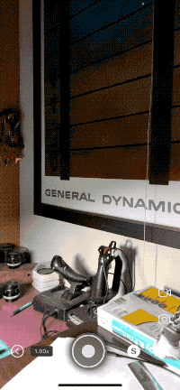

# Face Drop

[Face Drop][app] is an augmented reality app for iOS about selfies. The app flips the concept of a selfie on its head so to speak, with each snap the shutter button instead placing a copy of your face in the world. Face Drop is available. for free [in the app store][app].

This document covers using Face Drop. You can also [file issues and feature requests here][issues].

## Capturing a Selfie

To start using Face Drop, you first need to capture a selfie to place in the world. Devices with a TrueDepth camera can capture 3D selfies while older devices are limited to 2D images.

To get started, make sure Face Drop has camera permissions and then capture a selfie by pressing the camera button:

    

If you are having trouble getting Face Drop to recognize your face:

- Make sure your face is well lit.
- Make sure you face is not obscured. You may need to remove face masks for example for your face to be detected.

### Switching between 2D and 3D capture mode

Devices with a TrueDepth camera can also switch between a 3D selfie (the default) and a 2D selfie. Just tap on the `3D` or `2D` icon to switch modes.

## Placing selfies

After you capturing your beautiful selfie, it's time to place it in the world.

Face Drop uses your device's back camera to augment the world around you. Tap the camera button again to place a copy of your captured selfie in the world.

    

By default, Face Drop places copies of your face about half a meter in front of the camera.

### Rapid placement

Hold down the shutter button to rapidly place selfies:

    

Tap on the settings gear to adjust the placement rate.

### Placement modes

Face Drop features four different ways to place selfies in the world:

- `Snap` — The default. Places a copy of your selfie in front of the camera.
- `Drop` — Places copies of your selfie in front of the camera. The selfies drop to the ground after a few seconds.
- `Toss` — Throw copies of your selfie away from the camera.
- `Pin` — Attach a copy of your selfie to a real world surface. Requires a device with a LiDAR sensor. The target surface must be 5 meters or less so away.

`Snap`, `Drop`, and `Toss` are available on all devices. However if you want the selfies placed in `Drop` or `Toss` mode to realistically bounce off of with real world objects, you need a device with a LiDAR sensor.

`Pin` mode is exclusive to devices with a LiDAR sensor.

## Sharing

Tap the camera button on the right side to capture a image of the current visualization.

    

This image hides all UI elements so that you only see the visualizer.

Tap the video button to start recording a video.

    

This will show a prompt asking if you'd also like to record audio from your microphone:

    

Tap the video button again to stop recording.

After taking a video or image, you can download it to your photos or share it using the standard iOS share sheet. You can also trim videos right in the app.

[app]: https://apps.apple.com/us/app/face-drop-ar/id1569124225
[issues]: https://github.com/mattbierner/face-drop-support/issues

